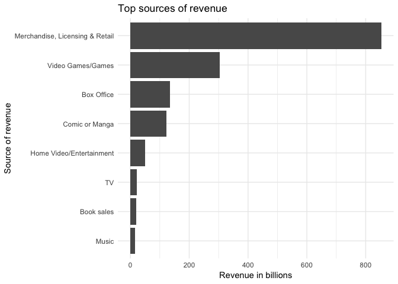
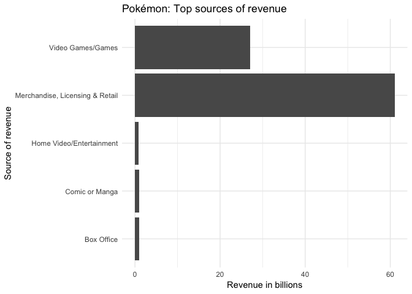
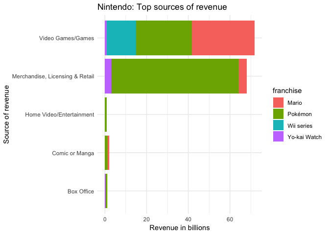
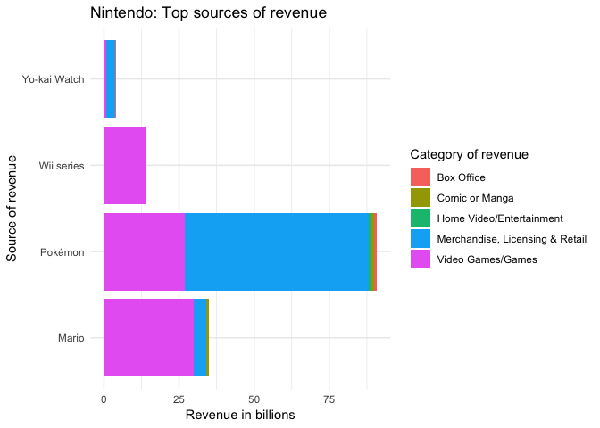

# Revenues from major media franchises
Benjamin C. Dean  
03/07/2019  

This is the TidyTuesday for the week of 3 July 2019. This week's dataset is about the revenues generated by major media companies over the past few decades.  

As a reminder, the idea is to take a new dataset each week and create something interesting within an hour.

https://github.com/rfordatascience/tidytuesday

## Set-up workspace
Import libraries, data and preliminary cleaning. 


```r
library(tidyverse)
library(stringr)
library(data.table)
```


```r
media_franchises <- readr::read_csv("https://raw.githubusercontent.com/rfordatascience/tidytuesday/master/data/2019/2019-07-02/media_franchises.csv")

media_franchises$revenue_category <- as.factor(media_franchises$revenue_category)
```

## Examine data
We take a look at what we're working with. Interestingly there are revenue categories, the respective revenues and the owners/creators of the respective franchises. 


```r
view(media_franchises)
glimpse(media_franchises)
```

```
## Observations: 321
## Variables: 7
## $ franchise        <chr> "A Song of Ice and Fire /  Game of Thrones", "A…
## $ revenue_category <fct> "Book sales", "Box Office", "Home Video/Enterta…
## $ revenue          <dbl> 0.900, 0.001, 0.280, 4.000, 0.132, 0.760, 1.000…
## $ year_created     <int> 1996, 1996, 1996, 1996, 1996, 1992, 1992, 1992,…
## $ original_media   <chr> "Novel", "Novel", "Novel", "Novel", "Novel", "A…
## $ creators         <chr> "George R. R. Martin", "George R. R. Martin", "…
## $ owners           <chr> "Random House WarnerMedia (AT&T)", "Random Hous…
```

## Analysis
What were the top sources of revenue over the years? The answer is 'Merchandise, licensing and retail'. 

```r
media_franchises %>%
  group_by(revenue_category) %>% 
  summarise(revenue = sum(revenue)) %>%
  arrange(desc(revenue)) %>%
  ggplot(aes(reorder(revenue_category, revenue), revenue)) +
  geom_bar(stat = "identity") +
  coord_flip() +
  labs(title="Top sources of revenue") +
  labs(x="Source of revenue", y="Revenue in billions") +
  theme_minimal() 
```

<!-- -->

Which owners have made the most money? The Walt Disney company, by far, followed by Nintendo.


```r
media_franchises %>%
  group_by(owners) %>% 
  summarise(revenue = sum(revenue)) %>%
  arrange(desc(revenue)) 
```

```
## # A tibble: 78 x 2
##    owners                                                           revenue
##    <chr>                                                              <dbl>
##  1 The Walt Disney Company                                            259. 
##  2 Nintendo (trademark) The Pokémon Company (Nintendo, Game Freak,…    90.9
##  3 Sanrio                                                              80.0
##  4 Lucasfilm (The Walt Disney Company)                                 63.0
##  5 Froebel-kan                                                         60.1
##  6 Nintendo                                                            49.0
##  7 DC Entertainment (AT&T)                                             44.4
##  8 Shueisha (Hitotsubashi Group)                                       36.3
##  9 Shueisha (Hitotsubashi Group) (manga) Bandai Namco (games)          33.2
## 10 Walt Disney Studios (The Walt Disney Company) (franchise) Sony …    31  
## # … with 68 more rows
```

Which creators have created the most value? 


```r
media_franchises %>%
  group_by(creators) %>% 
  summarise(revenue = sum(revenue)) %>%
  arrange(desc(revenue)) 
```

```
## # A tibble: 101 x 2
##    creators                    revenue
##    <chr>                         <dbl>
##  1 Satoshi Tajiri Ken Sugimori    90.9
##  2 Yuko Shimizu Shintaro Tsuji    80.0
##  3 A. A. Milne E. H. Shepard      74.5
##  4 Walt Disney Ub Iwerks          69.7
##  5 George Lucas                   63.0
##  6 Takashi Yanase                 60.1
##  7 Andy Mooney                    44.0
##  8 Shigeru Miyamoto               35.0
##  9 Shueisha                       33.2
## 10 Marvel Studios                 31  
## # … with 91 more rows
```

Let's  break down the Pokémon-related brands by revenue over the years.


```r
media_franchises %>%
  filter(str_detect(owners, 'Pokémon')) %>%
  ggplot(aes(revenue_category, revenue)) +
  geom_bar(stat = "identity") +
  coord_flip() +
  labs(title="Pokémon: Top sources of revenue") +
  labs(x="Source of revenue", y="Revenue in billions") +
  theme_minimal() 
```

<!-- -->

Let's do it again for Nintendo as a whole - but see if we can add a color layer to the franchises. 


```r
media_franchises %>%
  filter(str_detect(owners, 'Nintendo')) %>%
  ggplot(aes(revenue_category, revenue, fill = franchise)) +
  geom_bar(stat = "identity") +
  coord_flip() +
  labs(title="Nintendo: Top sources of revenue") +
  labs(x="Source of revenue", y="Revenue in billions") +
  theme_minimal() 
```

<!-- -->


```r
media_franchises %>%
  filter(str_detect(owners, 'Nintendo')) %>%
  ggplot(aes(franchise, revenue, fill = revenue_category)) +
  geom_bar(stat = "identity") +
  coord_flip() +
  labs(title="Nintendo: Top sources of revenue") +
  labs(x="Source of revenue", y="Revenue in billions") +
  scale_fill_discrete(name = "Category of revenue") +
  theme_minimal() 
```

<!-- -->

