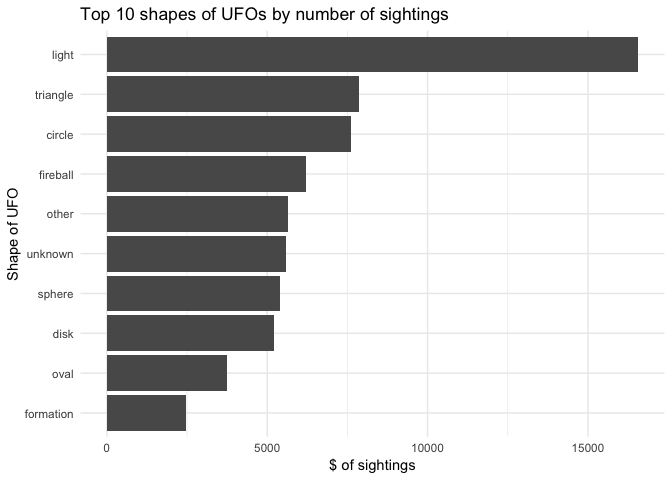
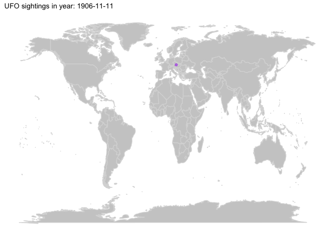

# ufoSightings
Benjamin C. Dean  
25/06/2019  

This is the TidyTuesday for the week of 25 June 2019. This week's dataset is all about UFO sightings over the past few decades. 

As a reminder, the idea is to take a new dataset each week and create something interesting within an hour.

https://github.com/rfordatascience/tidytuesday

## Set-up workspace


```r
library(tidyverse)
library(dplyr)
library(knitr)
library(gganimate)
library(maps)
library(lubridate)
library(ggplot2)
library(ggthemes)
library(gifski)
```

## Import data


```r
ufo_sightings <- readr::read_csv("https://raw.githubusercontent.com/rfordatascience/tidytuesday/master/data/2019/2019-06-25/ufo_sightings.csv")
```

```
## Parsed with column specification:
## cols(
##   date_time = col_character(),
##   city_area = col_character(),
##   state = col_character(),
##   country = col_character(),
##   ufo_shape = col_character(),
##   encounter_length = col_integer(),
##   described_encounter_length = col_character(),
##   description = col_character(),
##   date_documented = col_character(),
##   latitude = col_double(),
##   longitude = col_double()
## )
```

## Explore and clean the data
In particular we need to use the lubridate package to convert the character strings into date format. 


```r
ufo_sightings
```

```
## # A tibble: 80,332 x 11
##    date_time city_area state country ufo_shape encounter_length
##    <chr>     <chr>     <chr> <chr>   <chr>                <int>
##  1 10/10/19… san marc… tx    us      cylinder              2700
##  2 10/10/19… lackland… tx    <NA>    light                 7200
##  3 10/10/19… chester … <NA>  gb      circle                  20
##  4 10/10/19… edna      tx    us      circle                  20
##  5 10/10/19… kaneohe   hi    us      light                  900
##  6 10/10/19… bristol   tn    us      sphere                 300
##  7 10/10/19… penarth … <NA>  gb      circle                 180
##  8 10/10/19… norwalk   ct    us      disk                  1200
##  9 10/10/19… pell city al    us      disk                   180
## 10 10/10/19… live oak  fl    us      disk                   120
## # … with 80,322 more rows, and 5 more variables:
## #   described_encounter_length <chr>, description <chr>,
## #   date_documented <chr>, latitude <dbl>, longitude <dbl>
```

```r
ufo_sightings$date_documented <- mdy(ufo_sightings$date_documented)

ufo_sightings$date_time <-parse_date_time(ufo_sightings$date_time, "m/d/y HM")
```

## Explore shape of ufos
An unusual field is the shape of the UFO. I wonder how many shapes there are and which are the most commonly sighted? 


```r
ufo_sightings %>%
  count(ufo_shape) %>%
  arrange(desc(n)) %>%
  top_n(10) %>%
  ggplot(aes(reorder(ufo_shape, n), n)) +
  geom_bar(stat = "identity") +
  coord_flip() +
  labs(title="Top 10 shapes of UFOs by number of sightings") +
  labs(x="Shape of UFO", y="$ of sightings") +
  theme_minimal() 
```

```
## Selecting by n
```

<!-- -->

## Mapping
With a dataset like this, containing longitude and latitutde, we should try and map the sightings over time. This time I'll try using the gganimate package as well.


```r
# Tried to get just the data for Australia - however I still do not have a means by which to map them just on a map of Australia

# next time try:https://medium.com/@mueller.johannes.j/use-r-and-gganimate-to-make-an-animated-map-of-european-students-and-their-year-abroad-517ad75dca06 or https://weiminwang.blog/2015/06/24/use-r-to-plot-flight-routes-on-a-fancy-world-background/ 

#Aus <- ufo_sightings %>%
#  filter(country == "au") 

world <- ggplot() +
  borders("world", colour = "gray85", fill = "gray80") +
  theme_map() 

map <- world +
  geom_point(aes(x = longitude, y = latitude),
             data = ufo_sightings, 
             colour = 'purple', alpha = .5) +
  labs(title = 'UFO sightings in year: {frame_time}') +
  transition_time(date_time) +
  ease_aes('linear')

map
```

<!-- -->

```r
# export to gif
# anim_save("ufo.gif", map)
```
